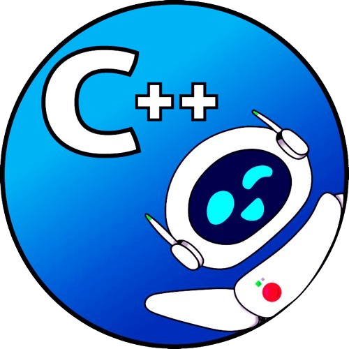

# Meet the C++ Taskbook! 

👋 Greetings, future programmers! 

🚀 C++ Taskbook is a project that will help you master the C++ programming language.

📚 Here you will find a variety of tasks that will help you:

- Test your knowledge of C++ language.
- Hone your practical skills.
- Repeat the necessary topics.
 
💪 You can already start solving test tasks! Choose the category you are interested in and get started. 

🌟 We wish you success and interesting discoveries in the world of programming! 
